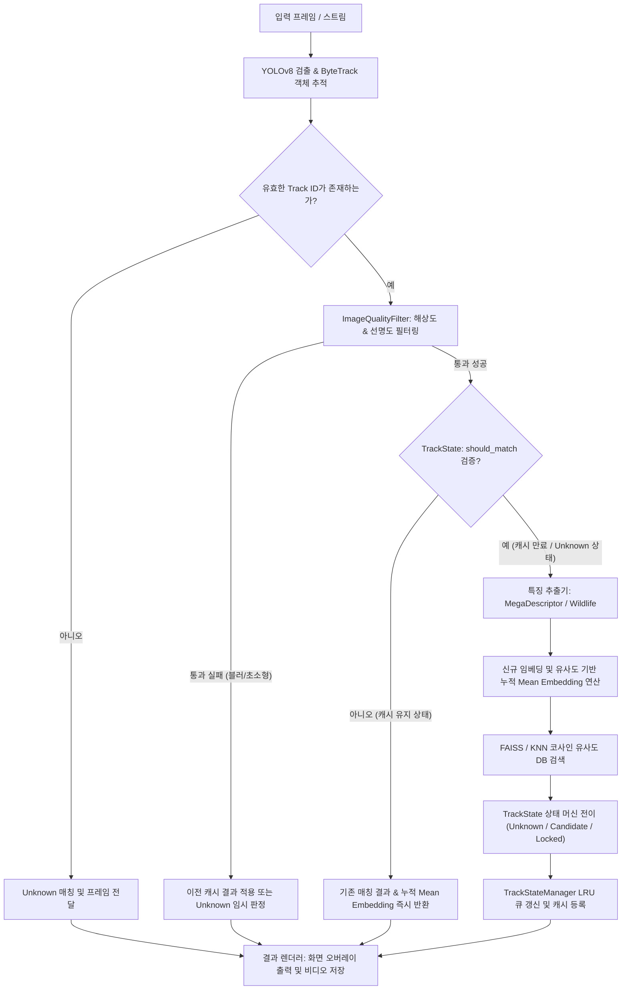

# Lumipet Re-ID System

Hello Street Cat 프로젝트의 고양이 개체 식별(Re-Identification) 프로세스를 자동화하고 가속화하기 위한 통합 모듈형 솔루션입니다. 본 프로젝트는 딥러닝 기반 객체 검출/추적 모델과 동물 전용 임베딩 추출 모델을 유기적으로 연합하여 고유 개체를 정밀하게 판별합니다.

---

## 1. 주요 목표 (Project Goals)

1. **정밀한 개체 식별 정확도 (High Accuracy)**
   - 고양이 얼굴 및 바디 영역에 특화된 BVRA/MegaDescriptor(Swin-L) 및 Wildlife-Tools 등의 동물 전용 Foundation Model을 연동하여 미세한 자세, 조명, 각도 변화에도 강건한 고양이 매칭 정확도를 보장합니다.
2. **실시간 스트리밍 추론 (Real-time Efficiency)**
   - 무거운 특징 추출 모델의 연산 병목을 극대화하여 해결하기 위해, 탐지(YOLOv8) 및 추적(ByteTrack) 연산을 기반으로 한 **상태 제어형 스마트 캐싱 시스템**을 도입하여 높은 FPS 성능을 제공합니다.
3. **높은 모듈성 및 유연성 (Extensibility & Clean Architecture)**
   - 컴포넌트들이 결합도가 낮은 인터페이스로 느슨하게 연결되어 있어, 검출기(Detector), 추출기(Extractor), 매처(Matcher) 등의 모듈을 소스 코드 수정 없이 환경설정(`.yaml`) 정의만으로 손쉽게 교체할 수 있습니다.

---

## 2. Re-ID 프로세스 흐름 (Pipeline Process)

본 프로젝트의 추론 루프는 다음과 같은 단계로 프레임을 분석하여 개체를 판단합니다.



---

## 3. 디렉토리 구조 및 설계 특징 (Project Structure)

### 디렉토리 구조
```text
reid/
├── core/
│   ├── config.py         # YAML 로드 및 CLI 오버라이드가 결합된 중앙 Config
│   ├── filters.py        # Laplacian 변동성 및 해상도 기반 ImageQualityFilter
│   ├── tracker.py        # 동적 상태 머신(TrackState) 및 LRU 캐시(TrackStateManager)
│   └── types.py          # BBox, MatchResult, Results 등의 핵심 데이터 전송 객체(DTO)
├── data/
│   ├── loader.py         # 학습 및 검증용 데이터 세트 분할(Gallery/Query) 로더
│   └── transforms.py     # 데이터 전처리 변환 파이프라인
├── engine/
│   ├── model.py          # 모델의 추상 인터페이스를 보장하는 BaseModel
│   ├── predictor.py      # 실시간 프레임/비디오 처리 루프를 조정하는 BasePredictor
│   ├── trainer.py        # 프로젝션 레이어의 Fine-tuning을 제어하는 학습 모듈
│   └── validator.py      # 추론 성능 분석 모듈
├── models/
│   ├── extractor/        # Wildlife / MegaDescriptor 전용 특징 추출 엔진
│   ├── matcher/          # FAISS / KNN 코사인 유사도 검색 매처
│   └── yolo/             # YOLOv8 검출기 및 추적기 모듈
├── pipeline.py           # 전체 컴포넌트 오케스트레이션 (ReIdPredictor)
└── cli.py                # 패키지 CLI 진입점 (main 함수)
```

### 설계 특징
- **추상화 기반 상속 구조**: 모든 Predictor와 Model은 [BasePredictor](file:///home/jhj/project_ws/lumipet_ws/re-id_test/reid/engine/predictor.py#L11)와 [BaseModel](file:///home/jhj/project_ws/lumipet_ws/re-id_test/reid/engine/model.py)을 상속받아 통일된 데이터 흐름 인터페이스를 준수합니다. 이를 통해 새로운 검출 알고리즘이나 하드웨어 연동 시 유연한 확장이 가능합니다.
- **컨테이너화 설계 (`reid/container.py`)**: 의존성 주입 패턴(Dependency Injection)을 따라 구체적인 객체(Faiss vs KNN, MegaDescriptor vs Wildlife) 생성을 중앙 빌더 함수에 위임하여 부품 교체 방식을 보장합니다.
- **분권형 트랙 상태 관리**: 각 고양이의 실시간 임베딩 이력 및 상태 머신 전이(Hysteresis)는 개별 [TrackState](file:///home/jhj/project_ws/lumipet_ws/re-id_test/reid/core/tracker.py#L5)에 완전히 캡슐화되어 있어, 코드가 선언적이고 간결합니다.

---

## 4. 환경 설정 및 설치 (Installation)

본 프로젝트는 설치성 편의와 패키징 배포를 위해 `setuptools` 기반의 `pyproject.toml` 설정을 지원합니다.

### 패키지 빌드 및 설치
```bash
# 가상 환경 생성 및 활성화
python3 -m venv .venv
source .venv/bin/activate

# 의존성 패키지와 현 프로젝트를 개발자 모드로 패키지 등록/설치
pip install -e .
```

---

## 5. 실행 방법 (CLI Usage)

개발자 모드로 설치가 완료되면, CLI 인터페이스인 `reid` 명령어를 통해 실행할 수 있습니다. 진입점은 `reid/cli.py`에 바인딩되어 동작합니다.

### 1. 고양이 특징 등록 (DB 생성)
학습/등록 폴더 구조(`datasets/개체명/*.jpg`) 내의 고양이들의 특징 벡터를 추출하여 데이터베이스(`embeddings/white_db.npz`)에 적재합니다.
```bash
reid register source=./datasets/heellostreetcat-individuals
```
*(단일 이미지 파일 등록 시: `reid register source=이미지경로 label=고양이이름`)*

### 2. 실시간 비디오 / 웹캠 추론 및 매칭
지정한 비디오 소스 또는 웹캠을 구동하고 화면상에 검출 결과를 시각화 렌더링합니다.
```bash
# 실시간 웹캠 추론
reid predict source=0

# 비디오 파일 기반 추론
reid predict source=./video.mp4
```

### 3. 검증 모드 (Validation)
보유한 고양이 데이터셋 내에서 갤러리(Gallery)와 쿼리(Query)를 분할하고 탑-k 유사도 분류 정확도 지표를 추출합니다.
```bash
reid val source=./datasets/heellostreetcat-individuals
```

### 4. 파인튜닝 학습 (Fine-tuning)
백본(Backbone) 모델 가중치를 동결한 뒤, 프로젝트 전용 개체 분류 임베딩을 구성하기 위해 Projection Layer 학습을 구동합니다.
```bash
reid train source=./datasets/heellostreetcat-individuals epochs=10
```

---

## 6. 주요 세부 설정 설명 (`config.yaml`)

[config.yaml](file:///home/jhj/project_ws/lumipet_ws/re-id_test/config.yaml)을 수정하여 알고리즘을 즉시 미세 조정할 수 있습니다.

- **추적 및 잠금 임계치 설정**
  - `threshold_candidate: 0.70`: 고양이라고 판단하기 시작하는 유사도의 하한 수치.
  - `threshold_lock: 0.85`: 고양이 ID의 판정을 확정 락(Lock) 상태로 잠그는 임계치.
  - `threshold_hysteresis: 0.55`: 잠금 해제 임계값 (매칭 신뢰도가 급격히 하락해 0.55 미만이 될 때 Lock 해제).
  - `candidate_interval: 10`: 후보(Candidate) 상태 시 추가 정보 수집을 위한 재매칭 프레임 주기.
  - `lock_interval: 60`: 락(Locked) 상태 시 개체 판정 유지를 검증하는 주기.
- **이미지 선명도/해상도 필터**
  - `min_bbox_width` / `min_bbox_height: 32`: 특징을 뽑기에 너무 작은 이미지를 기각할 박스 가로/세로 최저치.
  - `blur_threshold: 10.0`: Laplacian 분산 값을 기초로 한 흔들림(Blur) 감쇄 수치 (0.0 설정 시 필터 꺼짐).
